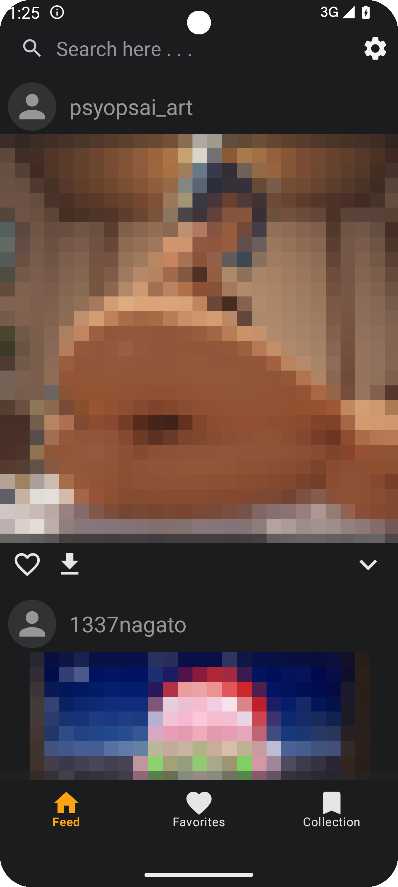
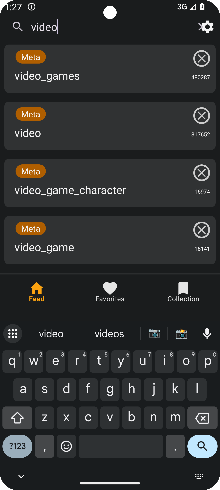
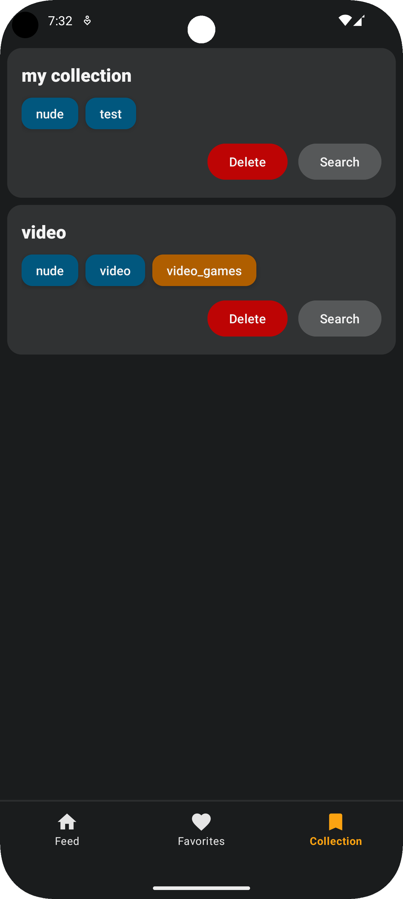
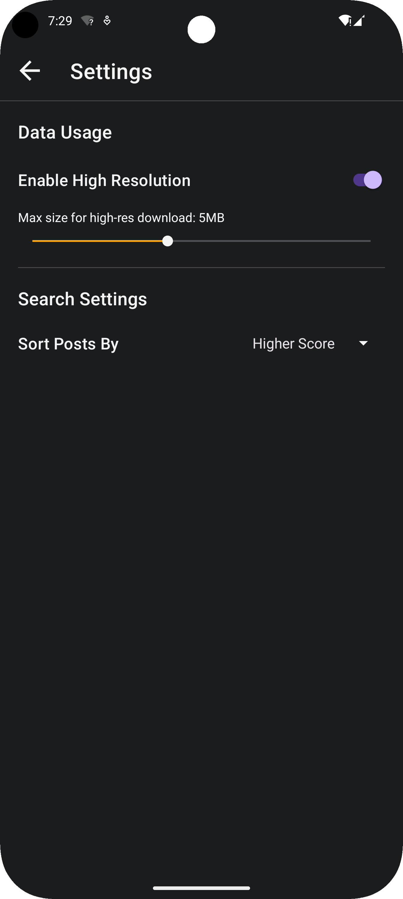
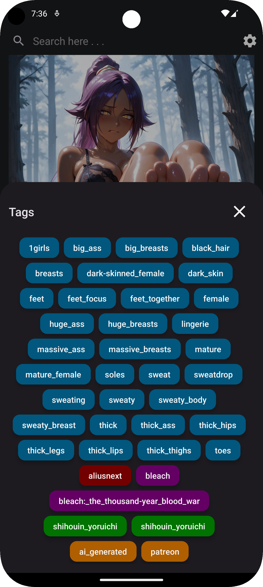

# Rule34 Android App

**Rule34-Android-App** is a sleek and powerful Android application designed to serve as a user interface for the Rule34 API. This app delivers a smooth and modern experience for browsing, viewing, and interacting with posts in a highly intuitive way.

## Links

- [Join Discord Server](https://discord.gg/3XPQgs7Kpp)
- [Click to download demo version.](https://github.com/HQhma/Rule34-Android-App/releases)

## Features

- **Video Player with Caching**
  - Seamlessly play videos with caching for improved performance and offline viewing.

- **Scroll Post View**
  - Explore posts effortlessly in an Instagram-like scrolling interface.

- **Search Tags and Suggestions**
  - Search posts by tags with intelligent tag suggestions to make your browsing experience even faster.

- **Save Tag Collections**
  - Create and save collections of tags for quick and easy access later.

- **Post Details**
  - View detailed information about each post, including tags and the post owner's details.

- **Download Posts**
  - Download your favorite posts directly to your device for offline access.

- **Like Posts**
  - Mark posts as favorites to save them within the app for later viewing.

- **Control Internet Usage**
  - Optimize your data usage by choosing to load posts in low or high resolution.

## Screenshots

Here are a few screenshots of the app:

|  |  |  |
|-----------------------------------------|-----------------------------------------|-----------------------------------------|
|  |  |  |

## Resources

- [Rule34.xxx](https://rule34.xxx)

## Coming Soon

**Rule34-Android-App** is currently in development and will be available soon.
A demo version is now available.
Stay tuned for the official release and source code!

## Download APK

Demo version 0.6.1 is now available. [Click to download.](https://github.com/HQhma/Rule34-Android-App/releases)

## License
This project is proprietary. All rights reserved. For more details, see the [LICENSE](./LICENSE) file.

