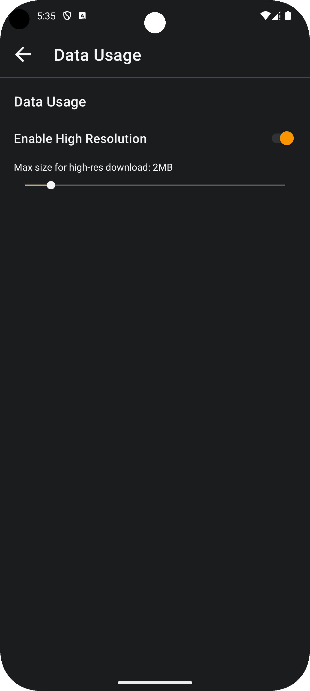
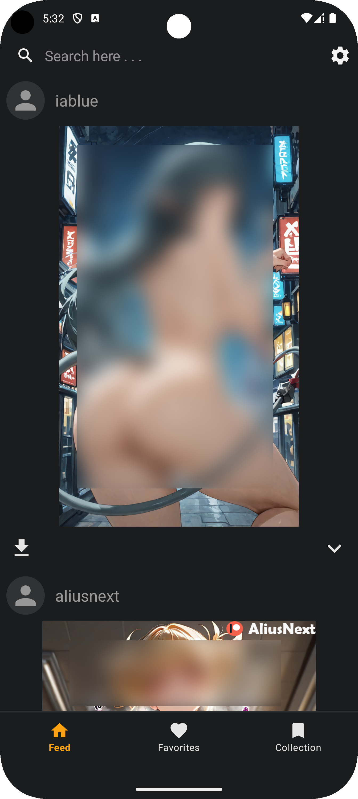
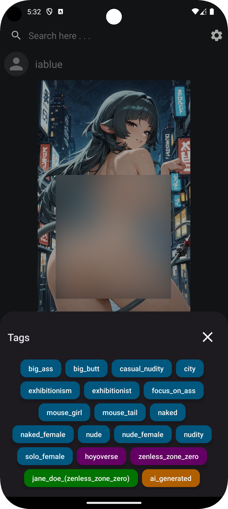
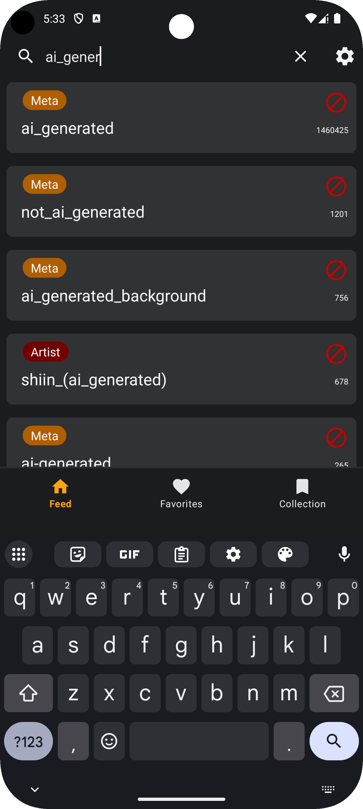
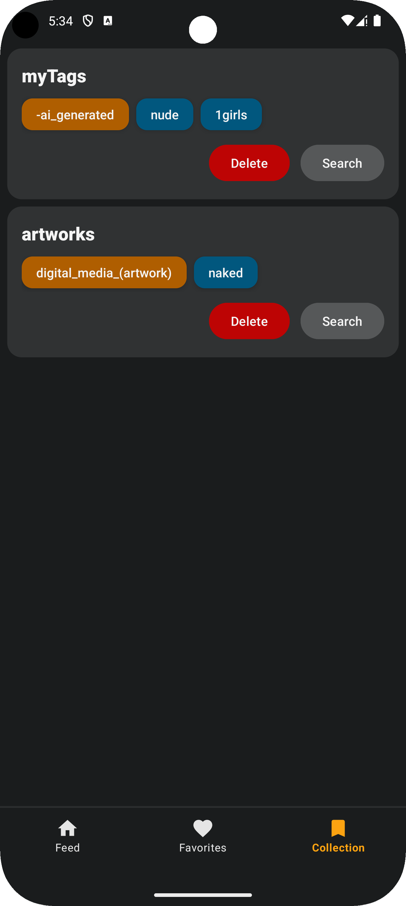
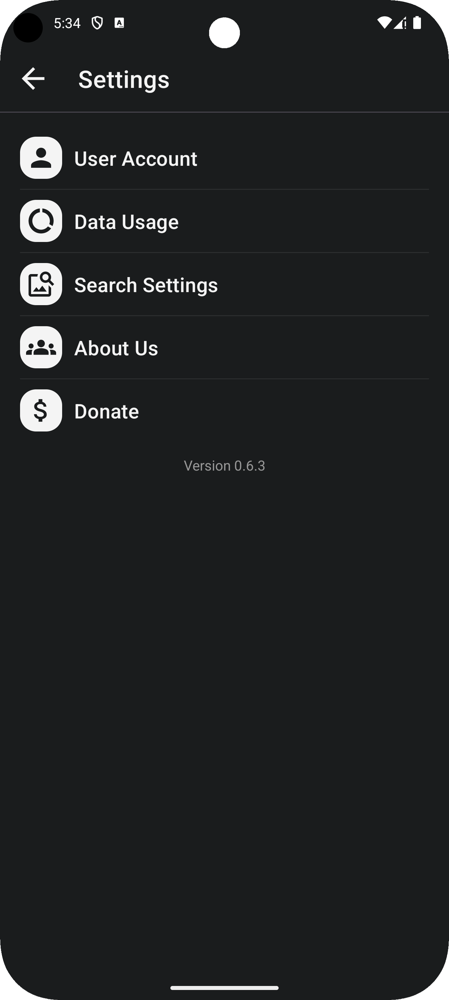

# Rule34 Android App

**Rule34-Android-App** is a sleek and powerful Android application designed to serve as a user interface for the Rule34 API. This app delivers a smooth and modern experience for browsing, viewing, and interacting with posts in a highly intuitive way.

**Note:** This is a community project and is not officially affiliated with Rule34.xxx. It is intended as a fan-made tool for interacting with publicly available content via the Rule34 API.

## Features

- **Smooth Video Playback** with caching for better speed 
- **Instagram-like Feed** for effortless post scrolling  
- **Smart Tag Search** with autocomplete suggestions  
- **Tag Collections** to save and manage your favorite tags  
- **Detailed Post View** with tags and uploader info  
- **Post Downloads** for offline access  
- **Favorites System** to like and save posts  
- **Data Saver Mode** with resolution control based on network limit

## Screenshots

Here are a few screenshots of the app:

|  |   |   |
|-----------------------------------------|-----------------------------------------|-----------------------------------------|
|  |  |  |

## Resources

- [Rule34.xxx](https://rule34.xxx)

## Coming Soon

**Rule34-Android-App** is currently in development and will be available soon.
A demo version is now available.
Stay tuned for the official release and source code!

## Download APK

Demo version 0.7.2 is now available. [Click to download.](https://github.com/HQhma/Rule34-Android-App/releases)

## License
This project is proprietary. All rights reserved. For more details, see the [LICENSE](./LICENSE) file.

